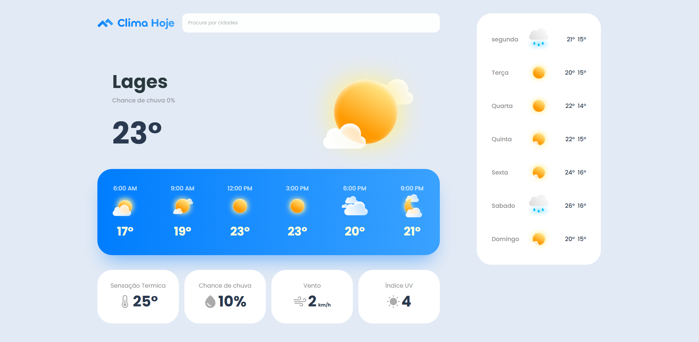
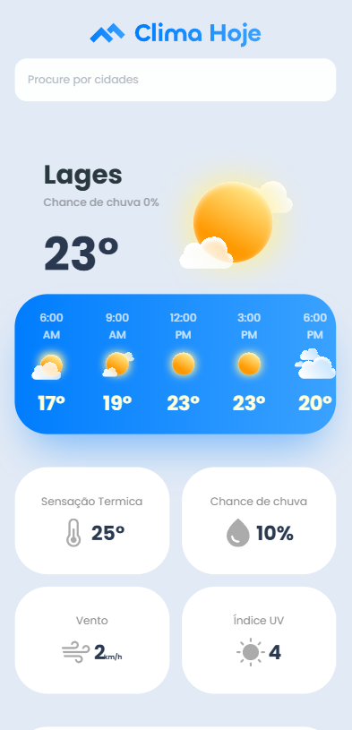

# 🌤️ Clima Hoje

Este é um projeto de **site de previsão do tempo**, desenvolvido como parte dos meus estudos no curso da plataforma **Full Stack Club**.

O objetivo do projeto foi praticar **HTML, CSS e responsividade**, criando uma interface moderna que funciona tanto em **desktop quanto em dispositivos móveis**.

---

## 🚀 Tecnologias utilizadas

- HTML5
- CSS3
- Flexbox
- CSS Grid
- Media Queries (Responsividade)

---

## 💻 Funcionalidades do projeto

- Interface de previsão do tempo
- Previsão por horário
- Previsão semanal
- Informações climáticas adicionais
- Layout responsivo para celular e tablet

---

## 📱 Responsividade

O projeto foi desenvolvido para funcionar corretamente em diferentes tamanhos de tela:

- Desktop
- Tablet
- Smartphone

---

## 📸 Preview do projeto

### Versão Desktop

### Versão Mobile

---

## 📂 Estrutura do projeto

Clima-Hoje
│
├── index.html
├── styles.css
├── mobile.css
├── Images
│
└── README.md

---

## 🎯 Objetivo do projeto

Este projeto faz parte da minha jornada de aprendizado em **desenvolvimento web**, onde estou praticando conceitos fundamentais de **front-end**.

---

## 👨‍💻 Autor

Desenvolvido por **Makson Matozo**

🔗 LinkedIn: (colocar link aqui depois)  
🔗 GitHub: https://github.com/Makson-Matozo
